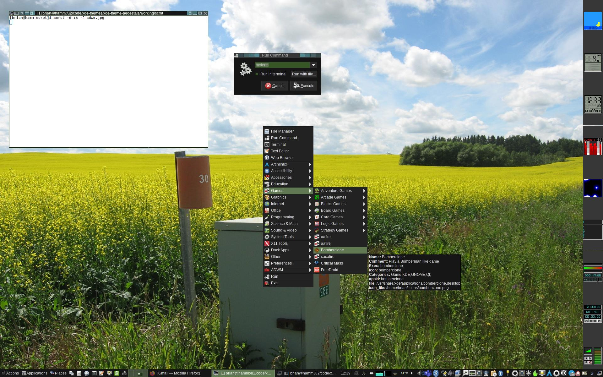
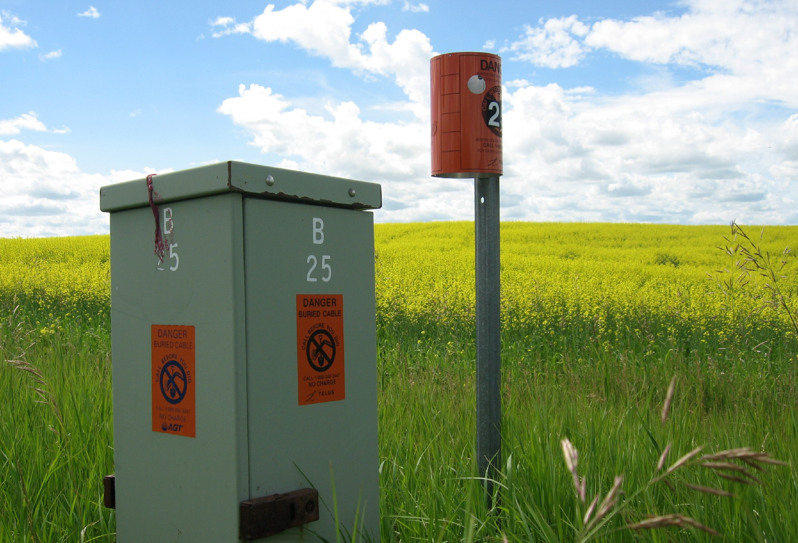
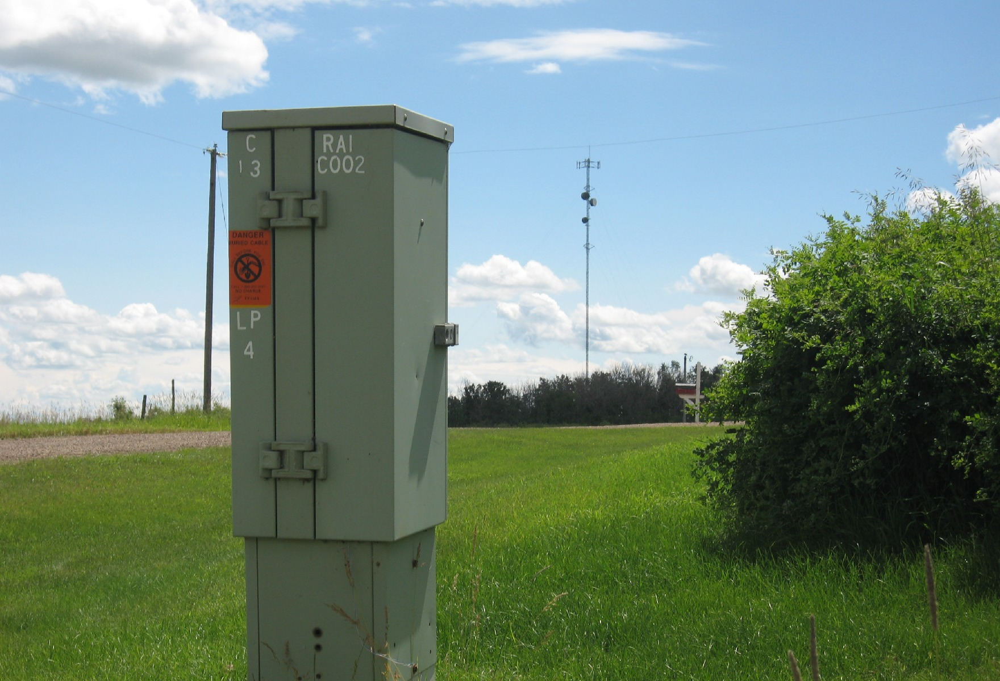
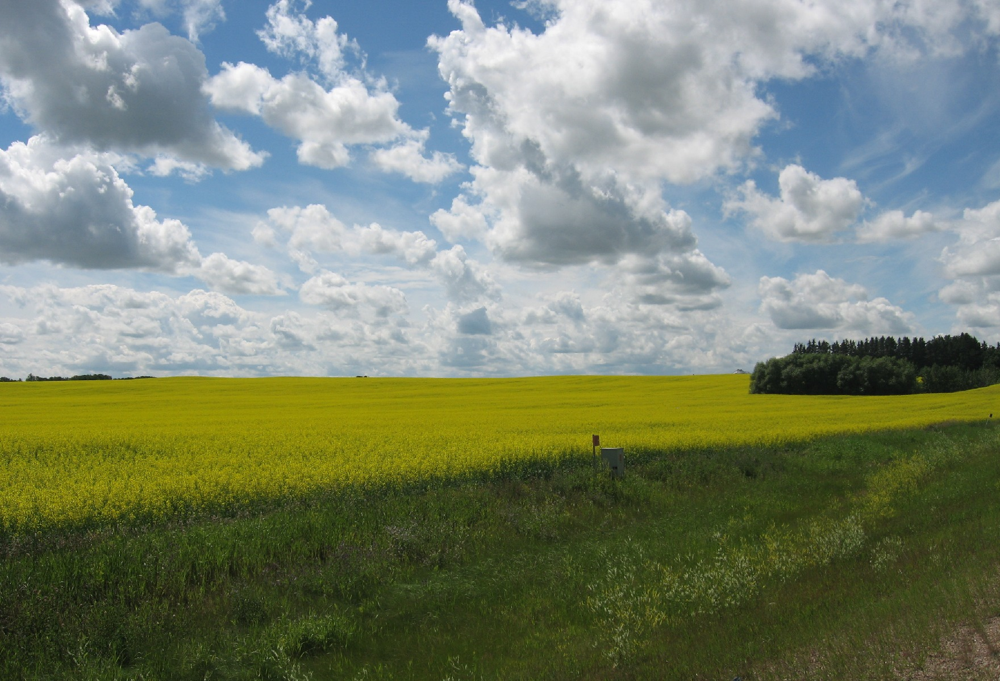

[xde-theme-pedestals -- read me first file.  2021-12-08]: #

xde-theme-pedestals
===============

Package `xde-theme-pedestals-1.2.3` was released under CCPL:cc-by-nc-nd-3.0
license 2021-12-08.

This is a theme and a set of backgrounds for the _XDE (X Desktop
Environment)_ that provides a set of backgrounds on
a Telephone Pedestals and T1 Repeater theme.
This theme uses the Squared-green style from the [`xde-styles`][11]
package.

The source for `xde-theme-pedestals` is hosted on [GitHub][1].

Release
-------

This is the `xde-theme-pedestals-1.2.3` package, released 2021-12-08.
This release, and the latest version, can be obtained from [GitHub][1],
using a command such as:

    $> git clone https://github.com/bbidulock/xde-theme-pedestals.git

Please see the [RELEASE][3] and [NEWS][4] files for release notes and
history of user visible changes for the current version, and the
[ChangeLog][5] file for a more detailed history of implementation
changes.  The [TODO][6] file lists features not yet implemented and
other outstanding items.

Please see the [INSTALL][8] file for installation instructions.

When working from `git(1)`, please use this file.  An abbreviated
installation procedure that works for most applications appears below.

This release is published under CCPL:cc-by-nc-nd-3.0 (primarily because
the base styles used to develop these styles were licensed under this
license).
Please see the license in the file [COPYING][10].

Please note that xde-theme-pedestals is no longer released as
a tarball and is only released as git commits; use:

    $> ./autogen.sh
    $> ./configure --version

to determine the version associated with a given commit in the
checked out working directory.  Note that this is the same version
as executing:

    $> git describe|sed 's,[-_],.,g;s,\.g*,,'

in the checked out working directory.

Note that only HEAD commits are stable: do not attempt to use any
other commit as only HEAD is synchronized with other packages in
the suite.

Quick Start
-----------

The quickest and easiest way to get `xde-theme-pedestals` up and
running is to run the following commands:

    $> git clone https://github.com/bbidulock/xde-theme-pedestals.git
    $> cd xde-theme-pedestals
    $> ./autogen.sh
    $> ./configure
    $> make
    $> make DESTDIR="$pkgdir" install

This will configure, compile and install `xde-theme-pedestals` the
quickest.  For those who like to spend the extra 15 seconds reading
`./configure --help`, some compile time options can be turned on and off
before the build.

For general information on GNU's `./configure`, see the file
[INSTALL][8].

Prerequisites
-------------

This package needs the [`xde-styles`][11] package to be useful and also
requires the `xde-setbg(1)` program from the [`xde-ctools`][12] package.

Issues
------

Report issues on GitHub [here][2].

Samples
-------

Following is a sample screenshot of the theme taken under the [ADWM][13]
window manager:

Following are the six wallpapers included in the theme (consisting
primarily of shots I took of pedestals by canola fields around Alberta
using an old Canon PowerShot):

Following are an additional fifteen wallpapers that may be used to
customize the theme:

[1]: https://github.com/bbidulock/xde-theme-pedestals
[2]: https://github.com/bbidulock/xde-theme-pedestals/issues
[3]: https://github.com/bbidulock/xde-theme-pedestals/blob/1.2.3/RELEASE
[4]: https://github.com/bbidulock/xde-theme-pedestals/blob/1.2.3/NEWS
[5]: https://github.com/bbidulock/xde-theme-pedestals/blob/1.2.3/ChangeLog
[6]: https://github.com/bbidulock/xde-theme-pedestals/blob/1.2.3/TODO
[7]: https://github.com/bbidulock/xde-theme-pedestals/blob/1.2.3/COMPLIANCE
[8]: https://github.com/bbidulock/xde-theme-pedestals/blob/1.2.3/INSTALL
[9]: https://github.com/bbidulock/xde-theme-pedestals/blob/1.2.3/LICENSE
[10]: https://github.com/bbidulock/xde-theme-pedestals/blob/1.2.3/COPYING
[11]: https://github.com/bbidulock/xde-styles
[12]: https://github.com/bbidulock/xde-ctools
[13]: https://bbidulock.github.io/adwm

[ vim: set ft=markdown sw=4 tw=72 nocin nosi fo+=tcqlorn spell: ]: #
